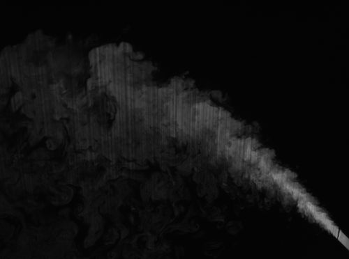
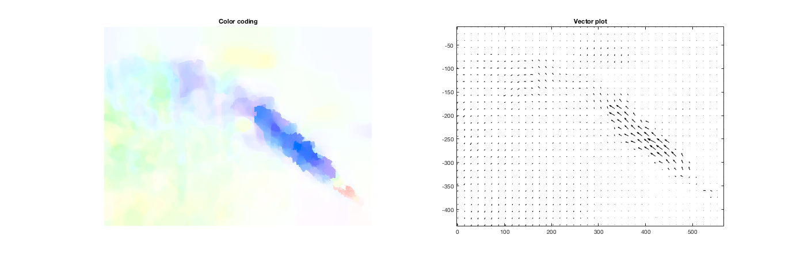

# About

Cuc is a graduate student at Nanyang Technological University. Her research focuses on optical flow and how to apply it to fluid dynamics. She is working at NEWRI institute (http://newri.ntu.edu.sg), under the supervision of Associate Professor Adrian Law.

# Optical Flow

Planar laser-induced fluorescence image of a flow

Velocity field

# Contact

Email: duongthi001@e.ntu.edu.sg

